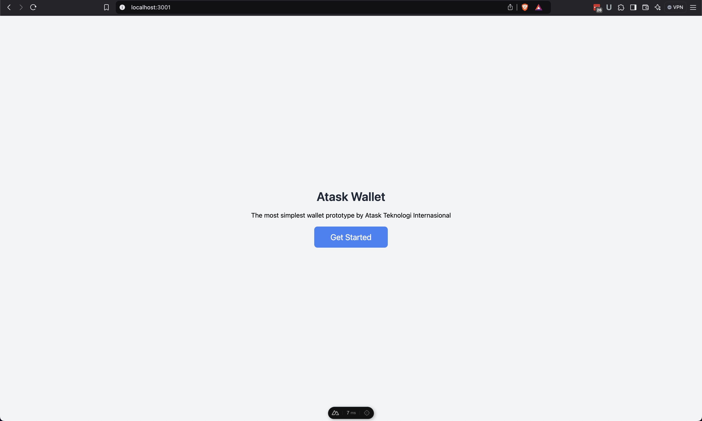

# Atask Wallet System
This project is a prototype of a simple wallet system application, created in order to follow the job test from Atask Teknologi International. This project consists of 2 main services that simulate how microservices work, 1 service acts as an API and 1 more service as a user interface. This project has also used docker and container orchestration, so that running it is not too complicated and does not require dependencies that must be installed on the user's computer.

## Table of Contents
- [Project Structure](#project-structure)
- [Tech Stack](#tech-stack)
- [Features](#features)
- [Getting Started](#getting-started)
  - [Prerequisites](#prerequisites)
  - [Installation](#installation)
  - [Configuration](#configuration)
    - [API Configuration](#api-configuration)
    - [WEB Configuration](#web-configuration)
  - [Setup](#setup)
  - [Usage](#usage)
- [Testing](#testing)
- [API Stock Lib Configuration](#api-stock-lib-configuration)
- [Key Notes](#key-notes)

## Project Structure
```plaintext
..
├── api/      # Rails Backend API
├── web/      # Nuxt.js Frontend UI
├── .gitignore
├── docker-compose.yml
├── Makefile
├── README.md
```

## Tech Stack
- **Backend**: [Rails 8](https://rubyonrails.org/)
- **Frontend**: [Nuxt.js](https://nuxt.com/), [Tailwind CSS](https://tailwindcss.com/)
- **Database**: [PostgreSQL](https://www.postgresql.org/)
- **Deployment**: [Docker](https://www.docker.com/)

## Features
- Basic authentication to authenticate the user
- Show user profile information
- Show user wallet and balance information
- Show user balance transaction history
- Deposit transaction to topup the balance
- Withdraw transaction
- Transfer transaction to move balance to another wallet account

## Prerequisites
Make sure to install the following tools
- [Make](https://www.gnu.org/software/make/)
- [Git](https://git-scm.com/)
- [Docker](https://www.docker.com/)
- [Docker Compose](https://docs.docker.com/compose/)

## Installation
Clone the repository:
```bash
 git clone https://github.com/dns2012/atask-wallet.git
```

## API Configuration
You are free to do this or not, because the initial rules are there by default, and can be used without doing this rule.

Copy file `api/.env.example` and make it as new `api/.env`, make sure it has environment variable like below

```env
RAILS_ENV=development
DB_HOST=postgres
DB_PORT=5432
DB_NAME=postgres
DB_USERNAME=postgres
DB_PASSWORD=postgres
MINIMUM_TRANSACTION_AMOUNT=10000
```

## WEB Configuration
You are free to do this or not, because the initial rules are there by default, and can be used without doing this rule.

Copy file `web/.env.example` and make it as new `web/.env`, make sure it has environment variable like below

```env
NODE_ENV=development
BASE_API_URL=http://localhost:3000
```

## Setup
To setup this application is very simple, the preparations starting from installation and related dependencies have been configured with docker and container orchestration

#### With Make Command
If you have `make` command already installed, you all need to do just run this following command

```bash
$ make app_start
```

#### With Docker Manual Command

```bash
$ docker compose up -d
```

#### Verify The Containers

After the command and build is completed, make sure all containers is running, using command 

```bash
$ make app_verify
```
or 
```bash
$ docker ps
```

For example, it should be look like this

```pretty
ae1bf6400479   atask-wallet-web       "docker-entrypoint.s…"   6 seconds ago   Up 3 seconds   0.0.0.0:3001->3000/tcp   atask-wallet-web-1
1bf84c05d702   atask-wallet-api       "entrypoint.sh bundl…"   6 seconds ago   Up 3 seconds   0.0.0.0:3000->3000/tcp   atask-wallet-api-1
f0cb9518acbb   postgres:latest        "docker-entrypoint.s…"   6 seconds ago   Up 3 seconds   0.0.0.0:5433->5432/tcp   atask-wallet-postgres-1
```

There will be 3 containers running at the same time
- **atask-wallet-api-1** for Backend / API Service
- **atask-wallet-web-1** for Web / UI Service
- **atask-wallet-postgres-1** for Database Service

#### Migration Setup

Now you need to run your migration command

```bash
$ make db_setup
```
 
 or manually using

```bash
$ docker compose exec -it api rails db:migrate
$ docker compose exec -it api rails db:seed
```

#### Stop Service
If you want to stop the service, run this following command

```bash
$ make app_stop
```
 
 or manually using

```bash
$ docker compose down
```

## Usage
After all containers are running successfully, the application will run at the following url

- **http://localhost:3000** for Backend / API Service
- **http://localhost:3001** for Web / UI Service

The documentation for the API is available at

- **http://localhost:3000/api-docs**

If you are prefer using swagger or import documentation using API testing tools you can use the swagger schema using this url

- **http://localhost:3000/api-docs.json?type=swagger**

For the WEB / UI it will contains simple user interfaces that could be as minimum interaction when using a wallet



Now you are ready to test the API backend service with end-to-end scenario using WEB / UI, if you want to test it separately just make an API request using that lovely documentation.

## Testing
For the testing purpose, use this 3 demo accounts which created by default
```pretty
email: ataskmaster@mail.com
password: atask123

email: bob@mail.com
password: atask123

email: john@mail.com
password: atask123
```

## API Stock Lib Configuration
To answer the task number 5, here is created a simple library called `atask_stock` which is saved in `lib` directory. However the author doesn't know it is the correct approach or not, because there can be different point of view about this things and probably the author is rarely use it as mentioned in the task. So the author hope it could be answer the task, how the lib `atask_stock` works ? it is a simple modular application which can run with any rails application, it has own controllers, models, config and routes. The author inspired by some Laravel plugin, which is there is need to attach the plugin to the main of the application code. But the attach process should works easily without writing to much code.

First, to install / setup the plugin do this command

```bash
$ make atask_stock_setup
```

That command will implement the available rake tasks to the current application, then it need to publish the plugin by

```bash
$ make atask_stock_publish
```

The command will attach the code from the lib to the current rails application automatically without make any single manual code writing or changes, at the end of the line it may look like

```pretty
Prefix Verb URI Pattern                        Controller#Action
api_v1_stock_prices GET   /api/v1/stock/prices(.:format) atask_stock/controllers/api/v1/stock#index
api_v1_stock        GET   /api/v1/stock/prices/:id(.:format) atask_stock/controllers/api/v1/stock#show
```

That's indicated the plugin installed successfully and ready to use as mentioned in the routes above.

Then if you want no longer need that lib you can easily remove them by 

```bash
$ make atask_stock_rollback
```

It will remove the lib / application and all it's depedencies. 

From this point about how it's work, we can imagine that `atask_stock` in the `lib` directory possible as a single git repository, so it possible to use at any rails application. But for now in this example it's still included as the child of current application repository.


## Key Notes
- This application is made very simple to represent the most basic way a wallet works
- The authentication process uses rails built-in and not a single one uses any other libraries or third party providers. 
- The authentication uses the simple basic rails auth, which is currently only set for 1 user 1 session
- This project uses 1 repository (mono repo) which contains 2 services orchestrated with Docker containers
- Fot the LatestStockPrice task aka `atask_stock` in this repository is not sure it's correct approach or not, the idea is to make the lib / plugin is easy to integrate / attach and detachable with any other rails application.